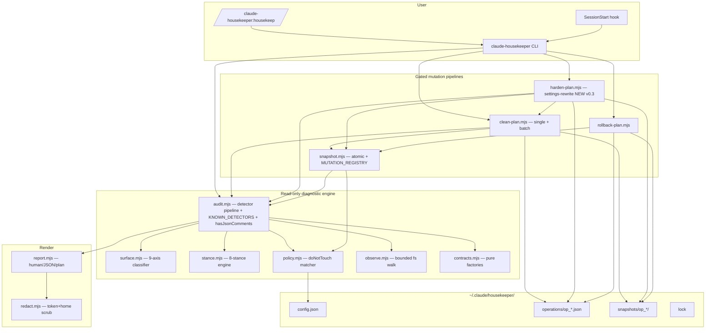
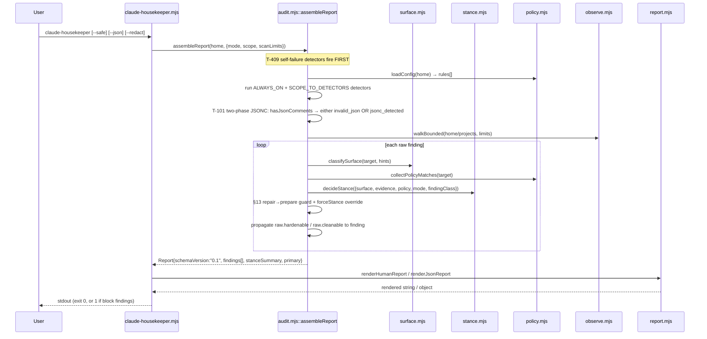
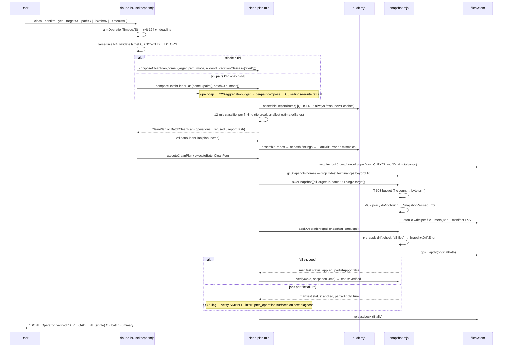
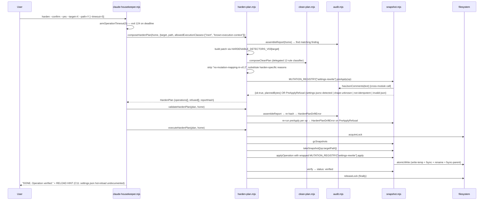
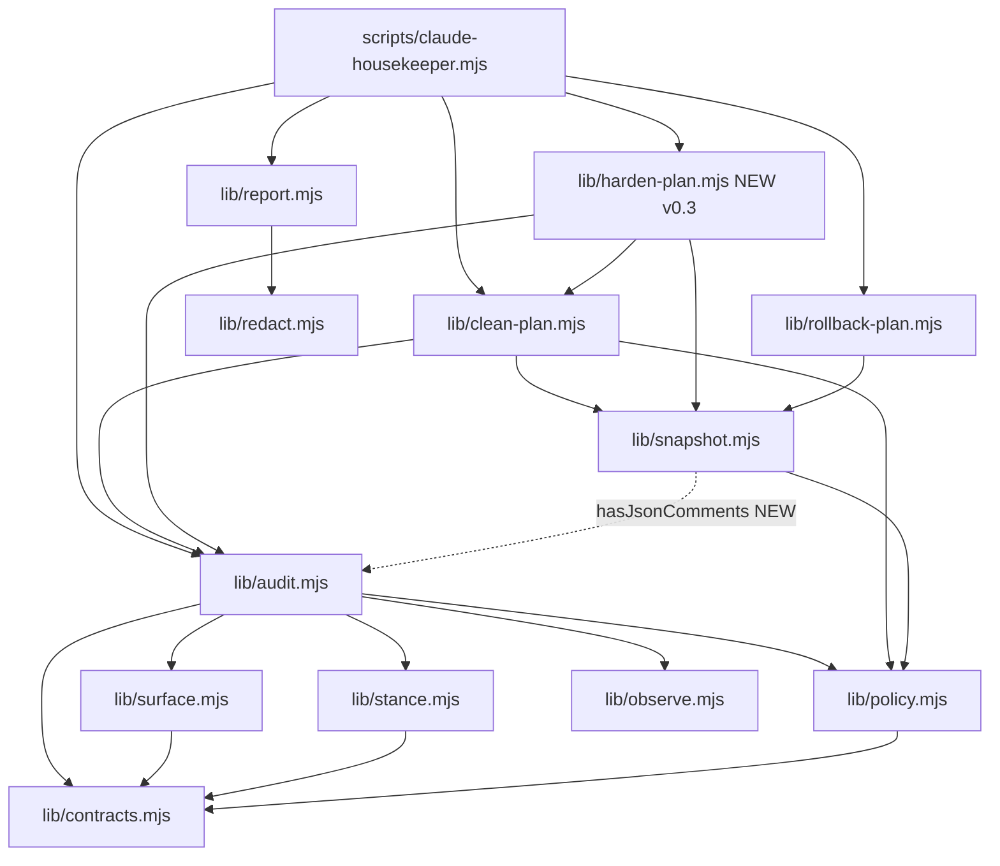

# Codebase Map

> Auto-generated by Cartographer (Opus orchestrator + 3 parallel Sonnet readers).
> Covers HEAD `c0cd43c docs(v0.4): plan + taskboard for v0.4 line (#97)` — past v0.2.0 GA, past v0.3.0 release, with v0.4 planning artifacts in tree.
> Surface mapped: 15 `scripts/*.mjs` + 26 `test/*.test.mjs` files (read in full) + the distribution surface (package, plugin, hooks, CI, custom agents) + 20+ load-bearing design docs + key notes. **Excludes** `.claude/worktrees/` (gone — worktree was removed in cleanup) and `fixtures/synthetic-homes/` content (enumerated only).

---

## What's new since v0.2.0-beta.1

| Surface | Added in | Highlights |
|---|---|---|
| **`harden` CLI subcommand** | v0.3 Phase 4 (T-400..T-403) | New top-level command. Same `--confirm --yes` gate. Wires through `composeHardenPlan → validateHardenPlan → executeHardenPlan` to rewrite `settings.json` atomically. Prints RELOAD HINT after success (C11). |
| **`settings-rewrite` mutation kind** | v0.3 Phase 1 (T-100..T-104) | New entry in `MUTATION_REGISTRY` (lives in `snapshot.mjs`). Three-hook contract: `preApply` (strict-parse → JSONC detect → patch in memory → idempotency check), `apply` (read → parse → patch → atomic-write), `rollback` (`copyFile` from snapshot). |
| **`scripts/lib/harden-plan.mjs`** | v0.3 Phase 2 (T-200..T-204) | New module — three-function pipeline mirroring `clean-plan.mjs`. Delegates 12-rule classification back to `composeCleanPlan` with widened `allowedExecutionClasses`. |
| **Two-phase JSONC detection** | v0.3 Phase 1 (T-101) | `audit.mjs` exports `hasJsonComments` (O(n) lex-aware). `settings.invalid_json` now suppresses itself when comments are detected; `settings.jsonc_detected` (new finding id) fires instead at `forceStance: "inform"`. |
| **`clean --batch`** | v0.3 Phase 5 (T-500..T-504) | `composeBatchCleanPlan` + `executeBatchCleanPlan` produce one snapshot manifest covering N pairs. Default cap 10, max 50. Excludes `settings-rewrite` (C6). Partial-apply leaves status `applied` for next-diagnose recovery (Q3). |
| **`--timeout=S` deadline (G15)** | v0.3 | `armOperationTimeout` wraps `clean` and `harden`. Exit code **124** on deadline (matches GNU `timeout(1)`). |
| **`KNOWN_DETECTORS` + parse-time `--target` validation (N4)** | v0.3 | `audit.mjs` exports the closed set; CLI rejects unknown ids before any I/O. |
| **`allowedExecutionClasses` parameter (T-099)** | v0.3 | New option on `composeCleanPlan`. Defaults to `["inert"]`; `composeHardenPlan` passes `["inert", "known-execution-context"]`. Gates rule 4 of the 12-rule classifier. |
| **`hardenable: true` on three promoted detectors** | v0.3 Phase 3 (T-300..T-302) | `settings.hook_path_dangling`, `settings.mcp_command_missing`, `settings.invalid_json` now expose the `hardenable` flag in findings. T-302 caveat: `invalid_json` is hardenable in the surface sense but `preApply` always refuses with `settings-shape-unknown` because strict-parse fails (Q1). |
| **`scripts/soak.sh`** | v0.2.0 GA (N3) | Bash runner exercising the full mutation pipeline against synthetic homes; used in release qualification. |
| **`.github/workflows/release.yml`** | v0.2.0 GA (N1) | Tag-driven release automation: sanity-checks tag matches `package.json` version, runs full test suite, packs tarball, extracts matching CHANGELOG section, creates GitHub release. |
| **CI `version-pin` job** | v0.2.0 GA (G4) | Fails CI if `docs/index.html` lacks the current `package.json` version string. |
| **`docs/versioning-policy.md`** | v0.2.0 GA (G12) | Codifies what's stable across a major: detector ids, refusal `class`/`reason` strings, both `schemaVersion` fields, bin name, CLI surface. |
| **`docs/migration-v0.2-to-v0.3.md`** | v0.3.0 | User-facing upgrade guide. |
| **`test/plugin-manifest.test.mjs`** | v0.3 (G6) | Replaces the CI `claude plugin validate` step that silently SKIPped on all GitHub-hosted runners. Asserts manifest schema, semver, version-lockstep with `package.json`. |
| **New fixtures** | v0.3 | `dual-scope-plugin-install` (G8), `plugin-installed-from-disk` (G8), `jsonc-settings` (T-101 fixture). |
| **`notes/PLAN-v0.4.md` + `TASKBOARD-v0.4.md`** | v0.4 planning | Six pillars: learning loop, MCP repair-beyond-stripping, plugin pruning audit, non-settings harden, JSONC v2 (comment-preserving), batch streaming. |

---

## System Overview

Housekeeper is a **read-only diagnostic + guarded-mutation CLI for Claude Code home inspection**. v0.3 adds `harden` for `settings.json` rewrites alongside the existing `clean` for plugin-cache and registry cleanups. Both are gated behind `--confirm --yes` with snapshot-backed rollback. Distributed as both standalone npm CLI (`claude-housekeeper`) and Claude Code plugin (`/claude-housekeeper:housekeep`).

**Zero runtime dependencies.** Pure Node.js ESM, built-ins only. No TypeScript, no transpilation, no test framework. A recovery tool must work when Claude itself is broken.



**New cross-dependency (v0.3):** `snapshot.mjs` now imports `hasJsonComments` from `audit.mjs` (for `settings-rewrite` `preApply`). `harden-plan.mjs` imports `composeCleanPlan` from `clean-plan.mjs` (delegates 12-rule classification).

---

## Directory Structure

```
housekeeper/
├── scripts/                          # CLI + pure library modules (15 .mjs files)
│   ├── claude-housekeeper.mjs        # CLI entry, dispatcher, verify probes, --timeout, --batch
│   ├── format-check.mjs              # Zero-dep tab+newline format checker
│   ├── soak.sh                       # NEW (v0.2 GA, N3): release-qualification soak runner
│   └── lib/                          # No I/O at construction time
│       ├── contracts.mjs             # Pure factories. SCHEMA_VERSION = "0.1". Leaf node.
│       ├── observe.mjs               # walkBounded (5000 files / 1 MiB / 5 s)
│       ├── surface.mjs               # classifySurface — 9-axis path heuristics
│       ├── stance.mjs                # decideStance — 8-stance decision engine
│       ├── policy.mjs                # loadConfig, pathMatchesProtection, matchPolicy
│       ├── audit.mjs                 # Detector pipeline + assembleReport + KNOWN_DETECTORS + hasJsonComments
│       ├── snapshot.mjs              # Atomic snapshot + apply + verify + GC + MUTATION_REGISTRY
│       ├── clean-plan.mjs            # compose → validate → execute (single + batch)
│       ├── harden-plan.mjs           # NEW (v0.3): settings-rewrite pipeline
│       ├── rollback-plan.mjs         # compose → validate → execute / abort
│       ├── report.mjs                # renderHumanReport / renderJsonReport / renderPlanReport
│       └── redact.mjs                # Token scrubbing, home collapse, hash truncation
├── test/                             # Node native --test (26 files, ~74k tokens)
├── hooks/
│   └── session-start.mjs             # Optional SessionStart hook (--safe --json), never blocks
├── commands/
│   └── housekeep.md                  # Plugin slash command surface
├── .claude-plugin/
│   └── plugin.json                   # name + version + description + commands manifest
├── fixtures/
│   └── synthetic-homes/              # ~20 fixture Claude homes, each with card.yaml + golden report
├── docs/                             # ~70 design + protocol + product docs + GitHub Pages site
│   └── design/                       # Deep memos (clean architecture / product / v0.3 architect / v0.3 platform / etc.)
├── notes/                            # Phase handoffs, taskboards (v0.1, v0.2, v0.3, v0.4), release readiness
├── .github/
│   ├── workflows/
│   │   ├── ci.yml                    # ubuntu+macos × node 20+22; test/lint/format/pack + version-pin (NEW)
│   │   └── release.yml               # NEW (v0.2 GA, N1): tag-driven release automation
│   └── ISSUE_TEMPLATE/               # 5 templates
├── package.json                      # "type": "module", zero deps, node >=20, bin: claude-housekeeper, v0.3.0
├── CHANGELOG.md                      # NEW (G1): backfills v0.1.0 → v0.3.0
├── README.md                         # User-facing docs + safety model + Hardenable column
├── CLAUDE.md                         # Agent guidance (== AGENTS.md modulo H1 title)
├── AGENTS.md                         # Agent guidance (== CLAUDE.md modulo H1 title)
├── LICENSE                           # MIT (Elad, 2026)
├── .gitignore                        # Ignores .claude/, .claudeignore, .vibeyardignore (this session)
└── .npmignore                        # Belt-and-suspenders; package.json `files` is authoritative
```

---

## Module Guide

### contracts.mjs — schema-shape source of truth (unchanged from v0.2)

**Exports:** `SCHEMA_VERSION` (`"0.1"`), `makeSurfaceClassification`, `makeEvidenceSet`, `makeFinding`, `makeStance`, `makeReport`, `makePolicyMatch`, `makeScanLimit`.

**Invariants:** All factories defensively copy arrays. `makeReport` hardcodes `filesChanged: false`. `STANCE_KEYS` defines the ordered taxonomy. Zero dependencies — true leaf node.

### observe.mjs — bounded filesystem walk (unchanged from v0.2)

**Exports:** `walkBounded(root, limits) → {entries, degraded, stopped}`, `DEFAULT_MAX_FILES=5000`, `DEFAULT_MAX_BYTES=1 MiB`, `DEFAULT_MAX_WALL_MS=5000`. Symlinks never traversed. Iterative DFS (no stack overflow on deep trees). Only `maxFiles` + `maxWallMs` enforced inside the walk (`maxBytes` is exported for callers).

### surface.mjs — 9-axis classifier (unchanged from v0.2)

**Exports:** `classifySurface(targetPath, hints) → SurfaceClassification`. 10-rule priority chain. Same as v0.2 — no v0.3 changes.

### stance.mjs — 8-stance decision engine (unchanged from v0.2)

**Exports:** `decideStance(args) → StancePayload`. Hard overrides → `protect`/`block` first; routing order `protect → block → probe → review → prepare → repair → watch → inform`. **v0.1 §13 degradation** still in place: any `repair` result rewritten to `prepare` with `nextAllowedStep: "deferred until v0.4 rollback infrastructure"`. (v0.4 plan is to lift this.)

### policy.mjs — config loader + path matcher (unchanged from v0.2)

**Exports:** `loadConfig`, `normalizeProtectionRules`, `pathMatchesProtection`, `matchPolicy`.

### audit.mjs — detector pipeline (v0.3 additions)

**New exports (v0.3):**
- `KNOWN_DETECTORS: ReadonlySet<string>` — closed set of every detector id. Used by CLI for parse-time `--target` validation (N4).
- `hasJsonComments(text): boolean` — O(n) lex-aware JSONC comment detector. Re-imported by `snapshot.mjs::MUTATION_REGISTRY["settings-rewrite"].preApply`.

**Detector registration changes:**
- `ALWAYS_ON_DETECTORS` unchanged (still 8 detectors).
- `SCOPE_TO_DETECTORS["settings"]` now includes `settings.jsonc_detected` (NEW finding id).
- **T-101 two-phase JSONC detection:** `detectSettingsInvalidJson` calls `hasJsonComments(context.settings.raw)`; if comments are found, suppresses itself and `detectSettingsJsoncDetected` fires instead with `forceStance: "inform"`. The two are disjoint — `settings.jsonc_detected` and `settings.invalid_json` cannot both fire for the same home.

**`buildFinding` additions:**
- `raw.hardenable` and `raw.cleanable` flags now propagated to the rendered finding (T-300..T-302 promote three settings detectors with `hardenable: true`).

**Force-stance overrides extended:** `settings.jsonc_detected` → `forceStance: "inform"`.

**Self-failure detectors fire FIRST** (T-409) — unchanged from v0.2.

### snapshot.mjs — atomic mutation primitives + MUTATION_REGISTRY (v0.3 major additions)

**Unchanged exports:** `MAX_OPERATION_FILES=50`, `MAX_OPERATION_BYTES=10 MiB`, `SCHEMA_VERSION_V2="0.2"`, `OPERATION_STATUSES`, `TERMINAL_STATUSES`, factories, `generateOpId`, `hashFile`, `atomicWrite`, `takeSnapshot`, `applyOperation`, `verify`, `gcSnapshots`, plus 4 error classes.

**New exports (v0.3):**
- `PreApplyRefusal` — error class returned (not thrown) by `MUTATION_REGISTRY[kind].preApply`. Callers check `result instanceof PreApplyRefusal`.
- `applyPatch(obj, patch) → newObj` — pure patch DSL. 3 ops: `remove` (delete nested key, idempotent), `set` (deep-clone nested set, idempotent), `append` (push to array, non-idempotent — tests only). Uses `structuredClone` + `JSON.stringify` canonicalisation for `deepEqual`.
- `MUTATION_REGISTRY: Readonly<{ "settings-rewrite": { preApply, apply, rollback } }>` — frozen registry of settings-rewrite hooks.

**`MUTATION_REGISTRY["settings-rewrite"]` three-hook contract:**

| Hook | Contract |
|---|---|
| `preApply(op)` | Five-step validation: strict `JSON.parse` → on `SyntaxError` run `hasJsonComments` → `applyPatch` in memory → JSON round-trip → idempotency (apply-twice equality). Returns `PreApplyRefusal` instance with one of 4 reasons: `settings-jsonc-detected`, `settings-shape-unknown`, `patch-produces-invalid-json`, `patch-not-idempotent`. |
| `apply(op)` | Re-reads file, parses, `applyPatch`, `JSON.stringify` + `os.EOL`, `atomicWrite`. Returns serialised content for `hashFile` post-check. |
| `rollback(op, snapshotEntry)` | `copyFile(snapshotEntry.snapshotPath, op.targetPath)`. Idempotent. |

**New cross-dependency:** `snapshot.mjs` now imports `hasJsonComments` from `audit.mjs` (used inside `preApply`). This is the only inter-module import that crosses the engine/mutation boundary backwards.

**Atomic-write protocol, drift check, GC, status state machine** — all unchanged from v0.2.

**Symlink semantics, `home` argument convention** (parent of `.claude` for `takeSnapshot`/`applyOperation`/`verify`/`gcSnapshots`) — unchanged.

### clean-plan.mjs — gated-mutation pipeline (v0.3 batch additions)

**Unchanged exports:** `MUTATION_KINDS`, `MUTATION_REGISTRY`, `composeCleanPlan`, `validateCleanPlan`, `executeCleanPlan`, `CleanPlanRefusal`, `PlanDriftError`, `LockHeldError`, `NotImplementedError`.

**New exports (v0.3):**
- `composeBatchCleanPlan(home, options) → BatchCleanPlan` — calls `composeCleanPlan` once per `--target`/`--path` pair, aggregates ops + refusals.
- `executeBatchCleanPlan(plan, home) → OperationManifest` — flattens all ops' `expandedFiles` into ONE `targets` list, takes ONE snapshot, dispatches per-file apply via parallel index table.
- `BatchBudgetError` — thrown when aggregate file/byte budget exceeded.
- `BATCH_DEFAULT_CAP = 10` — default pairs per batch.
- `BATCH_MAX_PAIRS = 50` — hard cap via `--batch=N`.
- `BATCH_AGGREGATE_FILE_LIMIT` = `MAX_OPERATION_FILES` (50). Same aggregate cap as a single op.
- `BATCH_AGGREGATE_BYTE_LIMIT` = `MAX_OPERATION_BYTES` (10 MiB).

**v0.3 changes to `composeCleanPlan`:**

| Change | Detail |
|---|---|
| `options.allowedExecutionClasses` parameter (T-099) | Defaults to `["inert"]`. Rule 4 of the 12-rule classifier checks `surface.executionClass` against this set. `composeHardenPlan` passes `["inert", "known-execution-context"]`. |
| `NEXT_STEP_BY_REASON` map | 14-entry refusal-reason → recovery-hint table (G7). Internal vocabulary (`ownerClass`, `executionClass`, `rollbackClass`) avoided in user-facing messages. |

**12-rule classifier — unchanged ordering**, but rule 4 now parameterised by `allowedExecutionClasses`. The cleanable detector set (`CLEANABLE_DETECTORS_V02`) is unchanged: `plugin.cache_unreferenced` → `dir-rmtree`; `housekeeper.stale_lock` + `registry.local_command_identical` → `file-unlink`.

**Batch semantics (T-500..T-504):**

- **C6 — `settings-rewrite` excluded from batch.** Per-pair refusal: `settings-rewrite-not-batchable`. Forces user to `harden` for settings.
- **C19 — pair-count cap.** Checked FIRST (short-circuits before any per-pair compose). `pairs.length > batchCap` → `batch-pair-cap-exceeded`.
- **C20 — aggregate budget.** Sum of `files + bytes` across all ops checked against `BATCH_AGGREGATE_*_LIMIT` → `batch-exceeds-aggregate-budget`; `operations` cleared.
- **Q3 — partial-apply semantics.** Per-file `apply()` failure → `partialApply: true`, status stays `applied`, `verify` skipped. Surfaces via `housekeeper.interrupted_operation` on next diagnose. **No auto-rollback.** User must `rollback <opId>` to restore ALL files (all-or-none batch restore).

### harden-plan.mjs — NEW v0.3 settings-rewrite pipeline

**Exports:**
- `composeHardenPlan(home, options) → HardenPlan` — re-runs `assembleReport`, builds patch per detector via `HARDENABLE_DETECTORS_V03` map, delegates 12-rule classification back to `composeCleanPlan` (then strips clean-specific refusal reasons).
- `validateHardenPlan(plan, home) → plan + validatedAt` — re-runs `assembleReport` for hash check, re-runs `preApply` per op to catch post-compose file mutations. Any `PreApplyRefusal` throws `HardenPlanDriftError`.
- `executeHardenPlan(validatedPlan, home) → OperationManifest` — lock pre-flight → `gcSnapshots` → per op: `takeSnapshot([op.targetPath])` → wrap `handler.apply` in callable → `applyOperation` → if `partialApply`: stop → `verify`. Lock in `finally`.
- `HardenPlanRefusal` (returned in `refused[]`), `HardenPlanDriftError`, `HardenLockHeldError`.
- `__acquireLockForTests`, `__releaseLockForTests` — test seams.

**`HARDENABLE_DETECTORS_V03` map:**

| Detector id | Patch builder | Effect |
|---|---|---|
| `settings.hook_path_dangling` | `buildHookPathDanglingPatch` (T-300) | `set` patch on `["hooks"]` with dangling entries pruned. Mirrors `audit.mjs::detectHookPathDangling` filter exactly. |
| `settings.mcp_command_missing` | `buildMcpCommandMissingPatch` (T-301) | `set` patch on `["mcpServers"]` with missing-command entries removed. |
| `settings.invalid_json` | `buildInvalidJsonSentinel` (T-302) | Identity-marker patch (`remove __housekeeper_harden_identity__`, no-op). `preApply` strict-parse always fails → `settings-shape-unknown` refusal (Q1). |

**Refusal taxonomy (HardenPlanRefusal):**

| Reason | Cause |
|---|---|
| `no-finding-for-target` | Detector emits no findings for the requested target. |
| `no-mutation-mapping-in-v0.3` | Detector not in `HARDENABLE_DETECTORS_V03`. |
| `settings-jsonc-detected` | Strict parse fails + JSONC comments detected (PreApplyRefusal). |
| `settings-shape-unknown` | Strict parse fails + no JSONC comments. |
| `patch-produces-invalid-json` | `applyPatch` throws or `JSON.stringify` returns `undefined`. |
| `patch-not-idempotent` | apply-twice check fails. |
| `settings-network-filesystem` | `__forceNetworkFs` test-seam OR `.housekeeper-network-fs` marker file in parent dir. |
| `plan-state-error` | Interrupted operation manifest exists. |
| `protected-path` | Matches `doNotTouch` rule. |
| **Plus** | Rules 1-9 from `composeCleanPlan`'s 12-rule classifier (delegated). |

**Key invariants:**
- **`allowedExecutionClasses` widened** to `["inert", "known-execution-context"]` (default) — wider than clean's `["inert"]`, allows settings.json surfaces through rule 4.
- **Classifier delegation:** strips `no-mutation-mapping-in-v0.2` from clean's output; substitutes `no-mutation-mapping-in-v0.3` for harden-specific non-registry ids.
- **NFS/SMB detection:** `looksLikeNetworkFs` triggers `settings-network-filesystem` refusal.
- **Idempotency-marker patch:** `{op: "remove", path: ["__housekeeper_harden_identity__"]}` — removing a non-existent key is a no-op; passes preApply idempotency check. Fallback when a real patch cannot be built.
- **`effectiveHardenableRegistry`** — test seam: `options.__overrideHardenable` injects extra detector ids without modifying the production registry.
- **One-op-per-plan** — enforced identically to clean-plan. Batch-harden is Phase 5 (not yet landed).
- **Lock protocol** — locally duplicated (same 30-min `LOCK_STALE_WINDOW_MS`, same O_EXCL `wx`). Deliberately decoupled from clean's lock implementation so the two pipelines share no private state.

### rollback-plan.mjs — snapshot-backed rollback (mostly unchanged; G16 addition)

**Unchanged exports:** `composeRollbackPlan`, `validateRollbackPlan`, `executeRollbackPlan`, `abortRollbackOperation`, plus error classes.

**v0.3 changes:**
- `abortRollbackOperation` now also allows `planned` status (G16: closes the "interrupted operation in planned state cannot be aborted" dead-end loop from v0.2).
- `ROLLBACKABLE_STATUSES` still `{applied, verified, snapshot_taken}` — but `planned` is now abortable separately.

**`ROLLBACK_REGISTRY`:** single entry `file-restore-from-snapshot` (`copyFile` + `mkdir -p`). Same kind handles `dir-rmtree`, `file-unlink`, **and `settings-rewrite`** rollbacks because they all snapshot the original file before mutation.

### report.mjs — renderers (unchanged from v0.2)

`renderHumanReport`, `renderJsonReport`, `renderPlanReport`. All apply `redactReport` first. `stripFindingForJson` whitelist unchanged. `proposedProbe` (T-210) forwarded.

### redact.mjs — privacy layer (unchanged from v0.2)

Pipeline order unchanged. Per-finding `sensitivityClass`-driven escalation always runs. Field names never rewritten, only values.

---

## Data Flow

### Diagnose (read-only, default)



### Clean (gated mutation — single or batch)



### Harden (NEW v0.3 — settings-rewrite mutation)



### Rollback (covers clean, batch-clean, harden, AND --abort)

```mermaid
sequenceDiagram
  participant U as User
  participant CLI as claude-housekeeper.mjs
  participant RB as rollback-plan.mjs
  participant SN as snapshot.mjs

  U->>CLI: rollback op_<id> --confirm --yes
  CLI->>RB: composeRollbackPlan(home, opId)
  RB->>RB: ROLLBACKABLE_STATUSES = {applied, verified, snapshot_taken}; detectDrift
  RB-->>CLI: RollbackPlan {operations[]} or refused[]
  CLI->>RB: validateRollbackPlan → re-hash snapshot files → SnapshotIntegrityError
  CLI->>RB: executeRollbackPlan
  RB->>SN: ROLLBACK_REGISTRY["file-restore-from-snapshot"] × N
  Note over RB: Same kind restores dir-rmtree, file-unlink, AND settings-rewrite operations
  RB->>RB: hashFile(originalPath) === sha256Before? else SnapshotIntegrityError
  RB->>SN: atomicWrite manifest status="rolled_back"

  Note over U,SN: --abort path (G16: now accepts planned status too)
  U->>CLI: rollback op_<id> --abort --confirm --yes
  CLI->>RB: abortRollbackOperation(opId, home)
  RB->>RB: assert status ∈ {snapshot_taken, planned} else AbortNotAllowedError
  RB->>SN: rm -rf snapshots/op_<id>/ + atomicWrite manifest status="aborted"
```

---

## Module Dependency Graph (v0.3)



**New v0.3 edges (dashed in mind):**
- `SNAPSHOT → AUDIT` (`snapshot.mjs::MUTATION_REGISTRY["settings-rewrite"].preApply` imports `hasJsonComments`).
- `HARDEN → CLEAN` (`composeHardenPlan` delegates 12-rule classification to `composeCleanPlan`).
- `HARDEN → AUDIT`, `HARDEN → SNAPSHOT` (own pipeline).

The graph is still acyclic. Leaf nodes: `contracts.mjs`, `observe.mjs`, `redact.mjs`.

---

## Command-to-Pipeline Map (v0.3)

| CLI Subcommand | Flags | Call chain |
|---|---|---|
| `diagnose` (default) | any | `runDiagnose → assembleReport → renderHumanReport \| renderJsonReport` |
| `plan` | any | `runPlan → assembleReport → renderPlanReport \| renderJsonReport` |
| `verify` | any | `runVerify → 6 sequential spawnSync probes (binary, plugin list, bare session, full session, tool use, subagent dispatch T-403)` |
| `clean` (no `--confirm`) | — | dispatcher gate → print DRY-RUN → exit 0 |
| `clean --confirm` (no `--yes`) | — | gate → `fail("Refusing mutation")` → exit 2 |
| `clean --confirm --yes` (single pair) | `[--timeout=S]` | `runClean → armOperationTimeout → runCleanInner → composeCleanPlan → validateCleanPlan → executeCleanPlan` |
| `clean --confirm --yes` (2+ pairs OR `--batch=N`) | `[--timeout=S]` | `runClean → runCleanBatch → composeBatchCleanPlan → executeBatchCleanPlan` (ONE manifest) |
| `harden` (no `--confirm`) | — | `runHarden → assembleReport → renderPlanReport` |
| `harden --confirm` (no `--yes`) | — | exit 2 `Refusing mutation` |
| `harden --confirm --yes` | `[--timeout=S]` | `runHarden → armOperationTimeout → runHardenInner → composeHardenPlan → validateHardenPlan → executeHardenPlan` |
| `rollback <id>` (no `--confirm`) | — | `composeRollbackPlan` + print → `fail` exit 2 |
| `rollback <id> --dry-run` | — | `composeRollbackPlan` + `printRollbackPlan(dryRun=true)` → exit 0 |
| `rollback <id> --confirm --yes` | — | `composeRollbackPlan → validateRollbackPlan → executeRollbackPlan` |
| `rollback <id> --abort --confirm --yes` | — | `abortRollbackOperation` (accepts `snapshot_taken` OR `planned` — G16) |

**Exit codes:** `0` success, `1` non-zero block findings or verify failure, `2` refusal/parse error, **`124` timeout** (matches GNU `timeout(1)`, NEW v0.3 via G15).

---

## Cleanable + Hardenable Kinds Status

### Materialised in v0.2

| Kind | Detector(s) | Operation |
|---|---|---|
| `dir-rmtree` | `plugin.cache_unreferenced` | `rm -rf` of plugin cache version dir |
| `file-unlink` (Phase 10) | `housekeeper.stale_lock`, `registry.local_command_identical` | Single-file `rm` |

### Materialised in v0.3

| Kind | Detector(s) | Operation |
|---|---|---|
| `settings-rewrite` | `settings.hook_path_dangling` (T-300), `settings.mcp_command_missing` (T-301), `settings.invalid_json` (T-302, identity sentinel — always refuses with `settings-shape-unknown`) | `applyPatch` DSL (remove/set/append) → atomic JSON write |

### Reserved (declared in `MUTATION_KINDS`, throw `NotImplementedError`)

| Kind | Notes |
|---|---|
| `file-replace` | Slot reserved; no detector consumes it. |
| `json-fragment-edit` | Slot reserved; no detector consumes it. |

### Permanent exclusions

- `plugin.expected_orphan` — never cleanable (Q-USER-3). Within the 7-day grace window by definition.
- `settings-rewrite` excluded from `clean --batch` (C6) — must use `harden`.

---

## Schema Versions

| Constant | Value | Location | Scope |
|---|---|---|---|
| `SCHEMA_VERSION` | `"0.1"` | `contracts.mjs` | Report object (`report.schemaVersion`) |
| `SCHEMA_VERSION_V2` | `"0.2"` | `snapshot.mjs` | Operation manifest (`manifest.schemaVersion`) |
| Plan `schemaVersion` | `"0.2"` (string literal) | `clean-plan.mjs`, `harden-plan.mjs`, `rollback-plan.mjs` | CleanPlan / HardenPlan / RollbackPlan / BatchCleanPlan |

**Independent versioning tracks.** Per `docs/versioning-policy.md` (NEW v0.2 GA, closes G12): adding fields / adding enum values = minor; removing/renaming/meaning-change = MAJOR + version bump + migration note; making redacted value raw = security regression, BLOCKED.

**Pre-1.0 caveat:** Stable-within-a-major policy is self-imposed starting with v0.2.0; v0.1→v0.2 was the last release that exercised pre-1.0 latitude.

---

## Budget + Timeout Constants

| Constant | Value | Location | Enforced by |
|---|---|---|---|
| `MAX_OPERATION_FILES` | 50 | `snapshot.mjs` | `takeSnapshot` file count check |
| `MAX_OPERATION_BYTES` | 10 MiB | `snapshot.mjs` | `takeSnapshot` byte sum via `stat` |
| `BATCH_DEFAULT_CAP` | 10 | `clean-plan.mjs` | Default `--batch` pair cap |
| `BATCH_MAX_PAIRS` | 50 | `clean-plan.mjs` | Hard cap on `--batch=N` |
| `BATCH_AGGREGATE_FILE_LIMIT` | = `MAX_OPERATION_FILES` (50) | `clean-plan.mjs` | Aggregate cap across all batch ops |
| `BATCH_AGGREGATE_BYTE_LIMIT` | = `MAX_OPERATION_BYTES` (10 MiB) | `clean-plan.mjs` | Aggregate byte cap across all batch ops |
| `DEFAULT_MAX_FILES` | 5000 | `observe.mjs` | `walkBounded` |
| `DEFAULT_MAX_BYTES` | 1 MiB | `observe.mjs` | exported only — callers enforce |
| `DEFAULT_MAX_WALL_MS` | 5000 | `observe.mjs` | `walkBounded` |
| `STALE_LOCK_WINDOW_MS` | 30 min | `clean-plan.mjs`, `harden-plan.mjs`, `rollback-plan.mjs` (each local) | `acquireLock` staleness check |
| GC keep count | 10 | `snapshot.mjs::gcSnapshots` | `verified`+`rolled_back` only (NOT `aborted`) |
| `PLUGIN_ORPHAN_GRACE_DAYS` | 7 | `audit.mjs` | `expected_orphan` vs `cache_unreferenced` split |
| **`--timeout=S` exit code** | **124** | `claude-housekeeper.mjs::armOperationTimeout` | Wraps `clean` and `harden`; matches GNU `timeout(1)` |

---

## Test Suite (26 files, ~74k tokens)

Runner: `node --test` (zero deps). All assertions: `node:assert/strict`. Tests run as `npm test`; lint as `npm run lint` (`node --check` across all `.mjs`); format as `npm run format`.

### New test files since v0.2.0-beta.1

| Test | Covers | Notable |
|---|---|---|
| `harden-plan.test.mjs` | `harden-plan.mjs` complete pipeline (T-200..T-204) | 20+ tests; refusal taxonomy, drift detection, idempotency, NFS detection, `__overrideHardenable` test seam |
| `clean-batch.test.mjs` | Batch composition + execute (T-500..T-504) | C6 settings-rewrite exclusion, C19 pair cap, C20 aggregate budget, Q3 partial-apply semantics, CLI full round-trip |
| `settings-rewrite.test.mjs` | `MUTATION_REGISTRY["settings-rewrite"]` (T-100..T-104) | 8+ tests: identity patch, single/nested patches, JSONC refusal, non-idempotent refusal, atomic-write, sha256 round-trip, rollback |
| `detector-promotion.test.mjs` | Three promoted detectors gain `hardenable: true` (T-300..T-302) | End-to-end harden integration tests |
| `plugin-manifest.test.mjs` | `.claude-plugin/plugin.json` schema + lockstep with `package.json` (G6) | **Replaces** the CI `claude plugin validate` gate that silently SKIPped on all GitHub-hosted runners |

### Coverage matrix (module → asserting tests)

| Module | Tests |
|---|---|
| `lib/audit.mjs` | `audit, fixtures, forbidden-language, redaction, safe-mode, schema-stability, self-failure, detector-promotion, readme` |
| `lib/clean-plan.mjs` | `clean-plan, clean-batch` (+ `no-mutation` allowlist) |
| `lib/contracts.mjs` | `contracts, report, stance, redaction, schema-stability` |
| `lib/harden-plan.mjs` | `harden-plan, detector-promotion` (+ `no-mutation` allowlist) |
| `lib/observe.mjs` | `observe` |
| `lib/policy.mjs` | `policy` |
| `lib/redact.mjs` | `redaction` |
| `lib/report.mjs` | `report, fixtures, forbidden-language, redaction, schema-stability` |
| `lib/rollback-plan.mjs` | `rollback-plan` (+ `no-mutation` allowlist) |
| `lib/snapshot.mjs` | `snapshot, snapshot-writer, settings-rewrite, clean-plan, rollback-plan, cli` (+ `no-mutation` allowlist) |
| `lib/stance.mjs` | `stance` |
| `lib/surface.mjs` | `surface` |
| `scripts/claude-housekeeper.mjs` (CLI) | `cli, clean-batch, readme` |
| `hooks/session-start.mjs` | `hooks` |
| `.claude-plugin/plugin.json` | `plugin-manifest` (NEW, G6) |
| `.github/ISSUE_TEMPLATE/` | `issue-templates` (T-406) |
| `README.md` | `readme` (T-503 doc-freshness) |
| `docs/schema-stability.md` | `schema-stability` (T-404 doc↔renderer contract) |

### Project-level invariant tests

| Test | Enforces |
|---|---|
| `no-mutation.test.mjs` | Source-grep ban of 12 fs-mutation primitives outside the **4-file** allowlist: `lib/snapshot.mjs`, `lib/clean-plan.mjs`, `lib/rollback-plan.mjs`, **`lib/harden-plan.mjs`** (added v0.3). |
| `forbidden-language.test.mjs` | 13 hard-banned phrases + contextual bans on `unused` and `healthy` requiring a hedging prefix. |
| `schema-stability.test.mjs` | Every field in `docs/schema-stability.md` stable-fields table is present in real `assembleReport` output. |
| `stance.test.mjs` (§13 sweep) | 560-combination Cartesian sweep proves `repair` is unreachable in v0.1. |
| `safe-mode.test.mjs` | Sector-boundary guard: no content from `credentials/**`, `.env`, `.ssh/**` reaches `safe`-mode report. |
| `self-failure.test.mjs` | Malformed config / missing home / unreadable ops-dir produce structured findings, never crash. |
| `readme.test.mjs` | README's `## Example output` shell command produces byte-equal output. |
| `plugin-manifest.test.mjs` (G6, NEW) | `.claude-plugin/plugin.json` is valid + version lockstep with `package.json`. |

### Fixtures index (`fixtures/synthetic-homes/`)

| Fixture | Scenario | New in v0.3? |
|---|---|---|
| `broken-hook-simple` | Hook command direct absolute path missing → `prepare` | |
| `broken-hook-shell-ambiguous` | Hook uses `$HOME/...` → `probe` | |
| `candidate-stale-cache` | Plugin cache beyond 7-day grace, not referenced → `probe` | |
| `checkpoint-only-rollback` | Path with only git-checkpoint rollback → `block` | |
| `clean-home` | No findings → `home.clean` → `inform` | |
| `dual-scope-plugin-install` | **NEW** Same plugin at both user and project scope → `review` | G8 |
| `duplicate-scope-plugin` | Two installs of same plugin within one scope | |
| `expected-orphan-cache` | Within 7-day grace, not in registry → `watch` | |
| `huge-home-degraded` | ~30 seed shards → `home.scan_budget_hit` | |
| `interrupted-housekeeper-operation` | `op_001.json` with `status: planned` → `block` | |
| `invalid-settings` | Malformed `settings.json` (no JSONC) → `settings.invalid_json` | |
| `jsonc-settings` | **NEW** `settings.json` with `//` comments → `settings.jsonc_detected` (not invalid_json) | T-101 |
| `local-shadow-diverged` | Local cmd shadows plugin cmd with different body | |
| `local-shadow-identical` | Local cmd byte-identical to plugin shadow | |
| `mcp-command-missing` | MCP `command` binary not on disk | |
| `plugin-installed-from-disk` | **NEW** Plugin from local disk path → no hygiene findings | G8 |
| `protected-secret-path` | Finding inside `credentials/` → `protect` | |
| `secret-command-fragment` | `settings.json` hook embeds raw API key — must not appear after `--redact` | |
| `symlinked-home` | `.claude` itself is a symlink | |

**Golden-report contract (T-X14):** Each fixture may ship `report.json` and/or `report.txt`. `fixtures.test.mjs` asserts `golden.mode === card-declared mode` and `golden.schemaVersion === SCHEMA_VERSION` to prevent silent three-way drift.

---

## Distribution Surface

### Package contract (`package.json`)

| Field | Value |
|---|---|
| `name` | `claude-housekeeper` |
| `version` | **`0.3.0`** |
| `type` | `"module"` (pure ESM) |
| `engines.node` | `>=20` |
| `dependencies` | **None — zero runtime deps** |
| `devDependencies` | None (test runner is Node built-in `--test`) |
| `bin.claude-housekeeper` | `./scripts/claude-housekeeper.mjs` |
| `scripts.test` | `node --test` |
| `scripts.lint` | `node --check` across all `.mjs` |
| `scripts.format` | `node scripts/format-check.mjs` |
| `files` | `.claude-plugin/, commands/, hooks/, scripts/, README.md, LICENSE` |

### Plugin manifest (`.claude-plugin/plugin.json`)

```json
{
  "name": "claude-housekeeper",
  "version": "0.3.0",
  "description": "Read-only Claude Code home inspection for broken hooks, plugin cache drift, protected state, and missing evidence keys.",
  "author": { "name": "Elad" },
  "license": "MIT",
  "homepage": "https://github.com/hemzaz/claude-housekeeper",
  "repository": "https://github.com/hemzaz/claude-housekeeper",
  "keywords": ["claude-code", "plugins", "diagnostics", "housekeeping"],
  "commands": ["./commands/"]
}
```

Slash command `/claude-housekeeper:housekeep` exposed via `commands/housekeep.md`. `disable-model-invocation: true` — model invokes the CLI, does not synthesise output. `allowed-tools: Bash(node:*), Bash(claude:*)`.

### SessionStart hook (`hooks/session-start.mjs`) — unchanged from v0.2

Runs `diagnose --safe --json` via `spawnSync`, 5 s timeout, **never blocks** session start, opt-out via `HOUSEKEEPER_SESSION_HOOK=off`.

### CI pipeline (`.github/workflows/`)

**`ci.yml`** triggers `pull_request` + `push to main`, matrix `{ubuntu, macos} × {node 20, 22}`, steps: checkout → setup-node → `npm test` → `npm run lint` → `npm run format` → `npm pack --dry-run`. **NEW v0.2 GA:** `version-pin` job asserts `docs/index.html` contains `v$(jq -r .version package.json)` (closes G4).

**`release.yml` (NEW v0.2 GA, N1):** triggers on `v*.*.*` tag push, single `release` job on `ubuntu-latest`. Sanity-checks `package.json` version matches tag, `npm test`, `npm pack`, extracts matching CHANGELOG section via `awk`, runs `gh release create` (or `gh release edit` + `gh release upload` if release already exists). No `npm publish` step — that remains manual.

### Issue templates (`.github/ISSUE_TEMPLATE/`)

5 templates: `cleanup-request.md`, `compatibility-report.md`, `damaged-environment.md`, `false-positive.md`, `loader-semantics.md`. All warn against pasting secrets (T-406).

### Custom subagents (`.claude/agents/`) — local-only, gitignored

| Agent | Model | Purpose |
|---|---|---|
| `detector-author` | sonnet | End-to-end authoring of new audit detectors |
| `mutation-safety-reviewer` | opus | Read-only review of diffs to mutation pipelines; 8 hard rules; BLOCK/WARN/APPROVE |
| `release-checker` | sonnet | Pre-release engineering+doc gates (test/lint/format/pack/plugin-validate + CHANGELOG/README/schema/migration) |
| `schema-guardian` | sonnet | Guards both `schemaVersion` contracts; runs T-404; diffs golden fixtures |

### Slash commands (`.claude/commands/`) — local-only, gitignored

`format`, `lint`, `test`, `verify` (cheapest-first chain), `review` (CLAUDE.md §1-4 + 8 housekeeper-specific violation classes).

---

## Architecture Canon

### The 9 surface axes

`surfaceClass, ownerClass, loadBearingClass, sensitivityClass, executionClass, rollbackClass, scopeClass, confidence, limits[]`. **Hard gate:** no actionable finding without a complete classification. `checkpoint-only` rollbackClass blocks mutation absolutely. `unknown` owner blocks mutation.

### The 8 stances (decision order)

`protect → block → probe → review → prepare → repair → watch → inform`

`repair` is unreachable in v0.1/v0.2/v0.3 (degrades to `prepare`). v0.4 plans to lift this with rollback infrastructure.

### Snapshot protocol invariants (10 rules)

Unchanged from v0.2. Key: **operation manifest written LAST** (presence signals complete snapshot). 50-file / 10 MiB hard cap per operation. `O_EXCL` lock with 30-min staleness. State machine `planned → snapshot_taken → applied → {verified, rolled_back, aborted}`.

### Mutation kinds & rollback symmetry

Every kind in `MUTATION_REGISTRY` (`snapshot.mjs`) has a corresponding restore path. `ROLLBACK_REGISTRY` has only `file-restore-from-snapshot` — sufficient for `dir-rmtree`, `file-unlink`, AND `settings-rewrite` because all three snapshot the original file(s) before mutation.

### `--safe` posture rules — unchanged from v0.2

No `claude` invocation (except `--version` probe), no hooks, no MCP, no skill shell injection, no plugin/project execution, no network, no secret content reads, no unbounded traversal, no mutation. MAY: parse JSON, list metadata, check direct path existence, count bounded files.

### Loader semantics

Documented in `docs/loader-semantics.md` (audited 2026-05-10 per `notes/LOADER-SEMANTICS-AUDIT.md`). Settings precedence (high→low): Managed → CLI → Local → Project → User. Plugin cache 7-day grace. MCP duplicate matching: by server name (local/project/user) or endpoint (plugin/connector). Hook deduplication automatic for identical handlers.

### Threat model — unchanged from v0.2 (with v0.3 settings-rewrite §8 addendum)

Single-user local boundary. Trust boundary = user's home. **Defended:** T1-T8 (lockfile concurrency, crash-recovery via state machine, doNotTouch hard boundary, budget caps, atomic-write protocol, drift checks, symlink no-traverse). **Out of scope (acknowledged):** multi-user homes, remote operation, manifest HMAC (G13 — same-uid attacker already owns home).

### Versioning policy verbatim (key sections from `docs/versioning-policy.md`)

> The following surfaces are stable across every release within a major line. Renaming, removing, or breaking the meaning of any of these is a major-version bump: detector ids; refusal `class` and `reason` strings; report `schemaVersion: "0.1"`; manifest `schemaVersion: "0.2"`; bin name and plugin command; public flags and command surface.

> The two `schemaVersion` values move on their own lines, but a bump in either is a project-level signal serious enough that the package version moves to v1.0 in the same release.

---

## Conventions & House Rules

- **Surface → finding → action, never short-circuit.** Detectors emit raw findings without severity. Classification, policy, and stance layered after.
- **Mutation requires Housekeeper-owned rollback proof.** Claude's checkpointing does not count.
- **Zero runtime dependencies.** Built-ins only.
- **No TypeScript, no transpilation.** Source runs directly under Node 20+.
- **Schema versions are stable contracts.** Both `"0.1"` (report) and `"0.2"` (manifest).
- **`--safe` posture skips MCP startup and hook execution** so diagnose works on a broken home.
- **Cleanable + hardenable kinds expand additively.**
- **Plugin install is optional.** Standalone CLI is the recovery path.
- **Read-only invariant enforced at source-grep level** by `no-mutation.test.mjs`. **4 files** are the mutation allowlist (v0.3): `snapshot.mjs`, `clean-plan.mjs`, `rollback-plan.mjs`, **`harden-plan.mjs`**.
- **Vocabulary discipline** enforced by `forbidden-language.test.mjs` (13 hard phrases + contextual bans).
- **Parse-time `--target=<id>` validation (N4):** validated against `KNOWN_DETECTORS` before any I/O.

---

## Gotchas (non-obvious behaviour worth remembering)

- **`home` argument convention differs.** `snapshot.mjs::takeSnapshot/applyOperation/verify/gcSnapshots` expect the **parent of `.claude`** (e.g. `~`); every other module uses `.claude` itself. Callers do `snapshotHome = dirname(home)`. **Unchanged from v0.2.**
- **Two `SCHEMA_VERSION` constants in different files** — `"0.1"` in `contracts.mjs` (report), `"0.2"` in `snapshot.mjs` (manifest). Independent.
- **`PreApplyRefusal` is returned, not thrown** — callers check `result instanceof PreApplyRefusal`. Easy to misuse.
- **`harden` settings-rewrite cross-module dep:** `snapshot.mjs::MUTATION_REGISTRY["settings-rewrite"].preApply` calls `audit.mjs::hasJsonComments`. The two pipelines (engine vs mutation) share this exactly-one import.
- **`hasJsonComments` is aliased.** `harden-plan.mjs` imports it from `audit.mjs`; `snapshot.mjs` also imports it from `audit.mjs` and re-aliases as `hasJsoncComments` internally. Same underlying implementation.
- **C6 batch exclusion:** `clean --batch` REFUSES any `settings-rewrite` operation with `settings-rewrite-not-batchable`. Users must route to `harden` for settings.
- **Q3 batch partial-apply:** No auto-rollback. Manifest stays at `applied` with `partialApply: true`; `verify` skipped. Next diagnose surfaces it via `housekeeper.interrupted_operation`. User runs `rollback <opId>` to restore the ENTIRE batch (all-or-none).
- **`hashFile` uses `lstat`** — symlinks hash their target string, not dereferenced content. `copyFile` in `ROLLBACK_REGISTRY` does not restore a true symlink.
- **`verify` never throws on hash mismatch** — sets `verifyFailure: true` and leaves status at `applied`. `interrupted_operation` detector picks it up next run.
- **`gcSnapshots` skips `aborted` ops.** Aborted manifests + their snapshot dirs accumulate until manual cleanup (or until `abortRollbackOperation` explicitly deletes the snapshot tree).
- **`renderHumanReport` always prints "No files changed."** Unconditional because `filesChanged: false` is hardcoded.
- **`forceStance` overrides the stance engine** — `interrupted_operation` → `block`; `cache_referenced_by_hook` → `protect`; `config_invalid`/`operations_unreadable`/`stale_lock` → `inform`; **`settings.jsonc_detected` → `inform` (NEW v0.3)**.
- **`hints.isHookCommand` takes precedence over plugin-cache-version-dir rule** in `classifySurface`.
- **The lock file at `<home>/.claude/housekeeper/lock`** acquired with `O_EXCL` (`wx`); EEXIST → check staleness (30 min), unlink + retry if stale, else `LockHeldError`. **Locally duplicated in 3 modules** (`clean-plan.mjs`, `harden-plan.mjs`, `rollback-plan.mjs`) — deliberately decoupled.
- **`--timeout` deadline** fires between awaited pipeline stages (`compose → validate → execute`). Exit code 124 (matches GNU `timeout(1)`). The synchronous stretches of `assembleReport` run to completion without preemption.
- **`CLAUDE.md` and `AGENTS.md` are duplicates (modulo the H1 title).** Intentional. Keep in sync.
- **`composeBatchCleanPlan` propagates only the FIRST per-pair `reportHash`** for drift detection. If concurrent home mutation between pair 1 and pair N, later hashes might differ silently.
- **`MUTATION_REGISTRY["dir-rmtree"]`** rm's per-file then attempts `rm(dir, {recursive:true})` after each (ENOTEMPTY swallowed until the last file). `"file-unlink"` in `MUTATION_REGISTRY` uses `unlinkSync`, but the execute path in `clean-plan.mjs::executeCleanPlan` rebuilds the callable inline using async `rm({recursive:false})`.
- **Subagent dispatch probe (T-403)** in `runVerify` uses `claude -p "Use the Task tool..." --allowedTools Task` with 60 s timeout matching `/\bREADY\b/`. `cli.test.mjs` static check asserts this label is NOT followed by `skipped: true`.

---

## Navigation Guide

**To add a new detector:**
1. Use the `detector-author` subagent (`.claude/agents/detector-author.md`).
2. Add pure function to `scripts/lib/audit.mjs`.
3. Register in `SCOPE_TO_DETECTORS` or `ALWAYS_ON_DETECTORS`.
4. **Add id to `KNOWN_DETECTORS`** (NEW v0.3 — N4 parse-time validation).
5. Add positive + negative fixture under `fixtures/synthetic-homes/<name>/` with `card.yaml` and golden `report.json`.
6. Add unit test under `test/`.
7. If introducing new finding `class` or affecting schema, update `docs/schema-stability.md` + `notes/TASKBOARD-v0.X.md`.

**To add a new cleanable kind:**
1. Use the `mutation-safety-reviewer` subagent before merging.
2. Add kind to `MUTATION_KINDS` (frozen array in `clean-plan.mjs`).
3. Implement `MUTATION_REGISTRY[<kind>]` in `snapshot.mjs` (if mutation primitive) or wrap in `clean-plan.mjs::executeCleanPlan` (if compositional).
4. Implement matching restore in `ROLLBACK_REGISTRY` in `rollback-plan.mjs` (rollback is symmetric — every mutation kind needs a restore).
5. Add detector(s) to `CLEANABLE_DETECTORS_V02` map + `FILE_UNLINK_DETECTORS_V02` if `file-unlink`.
6. Add tests: `clean-plan.test.mjs` + `rollback-plan.test.mjs`.

**To add a new hardenable detector (v0.3+):**
1. Use the `mutation-safety-reviewer` + `schema-guardian` subagents.
2. Add `hardenable: true` to the detector's raw output in `audit.mjs::buildFinding`.
3. Add entry to `HARDENABLE_DETECTORS_V03` map in `harden-plan.mjs` with a `patchBuilder` function.
4. Build patch via `applyPatch` DSL ops (`remove`, `set`, or `append`). Patch MUST be idempotent.
5. Add `detector-promotion.test.mjs` entry (end-to-end harden integration).
6. Update `docs/schema-stability.md` and README's Current Checks table.

**To modify the safety model:**
1. Read `docs/threat-model.md` + `docs/operational-readiness.md` first.
2. Surface area: `scripts/lib/snapshot.mjs` (budget + atomic write + lockfile) + 12-rule classifier in `scripts/lib/clean-plan.mjs`.
3. Use `mutation-safety-reviewer` subagent.
4. Update `docs/snapshot-architecture.md` + `docs/rollback-contracts.md`.

**To change a JSON report field:**
1. Use the `schema-guardian` subagent.
2. Add new field → safe; remove/rename/meaning-change → version bump required.
3. Update `docs/schema-stability.md` stable-fields table.
4. Run `node --test test/schema-stability.test.mjs` (T-404) — must pass.

**To touch the plugin surface:**
- Manifest: `.claude-plugin/plugin.json` (lockstep with `package.json` version, enforced by `plugin-manifest.test.mjs` G6).
- Command: `commands/housekeep.md` (do not change `disable-model-invocation` or `allowed-tools` without threat-model review).
- Hook: `hooks/session-start.mjs` (must never block; must default off without explicit env var).

**To prepare a release:**
1. Use the `release-checker` subagent.
2. CI gates (`ci.yml`): `npm test && npm run lint && npm run format && npm pack --dry-run` + `version-pin` job.
3. Doc gates: CHANGELOG entry (matching tag), README "Cleanable" + "Hardenable" columns updated, `docs/schema-stability.md` if schema changed, `docs/compatibility-matrix.md` if loader semantics changed, `docs/migration-vX.Y-to-vX.Z.md` for breaking changes.
4. Tag → `release.yml` automates: version check, test, pack, CHANGELOG extract, GitHub release.
5. `npm publish` is **manual** (not yet automated).

**To run tests locally:**
```bash
npm test                    # full suite
node --test test/audit.test.mjs    # single file
node --test --test-name-pattern "drift"   # by pattern
npm run lint                # node --check across all .mjs
npm run format              # custom format checker
```

**To run the soak (release qualification):**
```bash
bash scripts/soak.sh        # exercises full clean + harden + rollback against synthetic homes
```

---

## Design Memos & Notes Index

### `docs/design/` (selected — see `docs/doc-map.md` for full reading order)

| File | Size | Purpose |
|---|---|---|
| `clean-architecture-memo.md` | 65 KB | T-704 architect memo for v0.2 clean pipeline |
| `clean-claude-code-memo.md` | 49 KB | T-704 platform memo (Claude Code interop) |
| `clean-design.md` | 11 KB | T-704 synthesis: 12-rule refusal taxonomy, module layout |
| `clean-product-memo.md` | 45 KB | T-704 product memo |
| `clean-tie-breaker.md` | 57 KB | T-704 tie-breaker (17 conflicts ruled) |
| `v0.3-architect-memo.md` | **NEW** 55 KB | T-D01: end-to-end architecture for `settings-rewrite`, `harden`, batch, detector promotion |
| `v0.3-design.md` | **NEW** 19 KB | T-D04 synthesis: v0.3 buildable spec, Q1-Q5 rulings, module exports, pipeline contracts |
| `v0.3-platform-memo.md` | **NEW** 46 KB | T-D03: Claude Code interop — atomic rename under running Claude, JSONC parser analysis |
| `v0.3-product-memo.md` | **NEW** 49 KB | T-D02: CLI surface, refusal phrasing, `nextStep` copy, end-to-end transcripts |

### Load-bearing `docs/` (synthesised above)

`architecture.md`, `protocol-contracts.md`, `protocol-model.md`, `protocol-spec.md`, `snapshot-architecture.md`, `rollback-contracts.md`, `schema-stability.md`, `threat-model.md`, `safe-mode.md`, `loader-semantics.md`, `surface-classification-spec.md`, `policy-grammar.md`, **`versioning-policy.md` (NEW v0.2 GA, G12)**, `migration-v0.1-to-v0.2.md`, **`migration-v0.2-to-v0.3.md` (NEW)**, `compatibility-matrix.md`, `north-star.md`, `public-promise.md`, `operator-doctrine.md`, `state-governance.md`.

### `notes/` — phase + planning artifacts

| File | Purpose |
|---|---|
| `HANDOFF-CODEX-PHASE-8.md` | Phase 8 handoff: rollback CLI wiring |
| `HANDOFF-PHASE-10.md` | Phase 10: `file-unlink` for `housekeeper.stale_lock` + `registry.local_command_identical` |
| `LOADER-SEMANTICS-AUDIT.md` | 2026-05-10 audit of loader-semantics.md vs live Claude Code docs |
| `MODULE-BOUNDARIES.md` | Canonical export/import topology |
| `PLAN.md` | Master v0.1 plan |
| `PLAN-v0.2.md` | v0.2 plan + locked decisions Q1-Q5, Q-USER-1..3 |
| `PLAN-v0.3.md` | v0.3 plan + Q1-Q5 design rulings (settings-rewrite, harden, batch, detector promotion) |
| `PLAN-v0.4.md` | **NEW** v0.4 plan: 6 pillars (learning loop, MCP repair, plugin prune, non-settings harden, JSONC v2, batch stream) |
| `RELEASE-READINESS-v0.2.0.md` | v0.2.0 release readiness review (G1-G16, N1-N10) |
| `SECURITY-CICD-SCAN-2026-05-11.md` | CI/CD security scan |
| `TASKBOARD.md` | Master v0.1 task board |
| `TASKBOARD-v0.2.md` | v0.2 task board (all complete) |
| `TASKBOARD-v0.3.md` | v0.3 task board (all complete at v0.3.0) |
| `TASKBOARD-v0.4.md` | **NEW** v0.4 task board (all pending, branches from `46c6179` v0.3.0 tag) |
| `TRACEABILITY.md` | Requirement-to-implementation traceability |

---

## Versioning + Current State

| Tag | Status |
|---|---|
| `v0.1.0`, `v0.1.1`, `v0.1.2` | Shipped |
| `v0.2.0-alpha.1`, `v0.2.0-beta.1` | Shipped |
| `v0.2.0` | Shipped (GA) |
| `v0.3.0` | **Current released** (commit `46c6179`) |
| HEAD `c0cd43c` | `docs(v0.4): plan + taskboard for v0.4 line (#97)` — v0.4 planning landed |

**Stable in v0.3:** `schemaVersion: "0.1"` report fields, `schemaVersion: "0.2"` manifest fields, detector ids (including new `settings.jsonc_detected`), refusal `reason` strings, bin name `claude-housekeeper`, all public flags. **Reserved:** `file-replace`, `json-fragment-edit`.

**v0.2 → v0.3 migration key facts:**
- `diagnose`, `plan`, `verify`, `clean` unchanged for existing detectors.
- New top-level command `harden` — same `--confirm --yes` gate.
- New finding id `settings.jsonc_detected` (disjoint from `settings.invalid_json`).
- New flag `--batch=N` for `clean` (single-pair invocations unchanged).
- New flag `--timeout=S` for `clean` and `harden`; exit code 124 on deadline.
- Three settings detectors now expose `hardenable: true` in findings.
- Operation manifests written by `harden` use the same `schemaVersion: "0.2"`.

**v0.4 planned (per `notes/PLAN-v0.4.md`):**
- `housekeeper learn` (learning loop)
- `--mcp-command-rewrite` (MCP repair beyond stripping)
- `housekeeper prune` (plugin pruning audit; audit-only)
- Non-settings harden (`registry.*`, `hooks.*`, `skills.*`)
- JSONC v2 (comment-preserving rewrite)
- Batch streaming (`--stream` for N > 50)
- Lockfile observability (`lock.history`)
- **Lift §13 `repair → prepare` degradation** (enables the `repair` stance reachable for the first time).

---

## `.gitignore` / `.npmignore`

**`.gitignore`** ignores: `node_modules/`, `.DS_Store`, `.omc/`, `.worktrees/`, **`.claude/`** (NEW this session), **`.claudeignore`** (NEW this session), **`.vibeyardignore`** (NEW this session), `AGENTS.md`, `coverage/`, `dist/`, `*.tgz`, `.env*` (except `.env.example`), `*.log`, `.idea/`, `.vscode/`, `*.swp`.

**`.npmignore`** ensures the npm tarball excludes dev/local artifacts: `.omc/`, `.git/`, `node_modules/`, `coverage/`, `dist/`, `*.tgz`. The `files` array in `package.json` is the authoritative positive allowlist.

Net tarball: `.claude-plugin/`, `commands/`, `hooks/`, `scripts/`, `README.md`, `LICENSE`.
